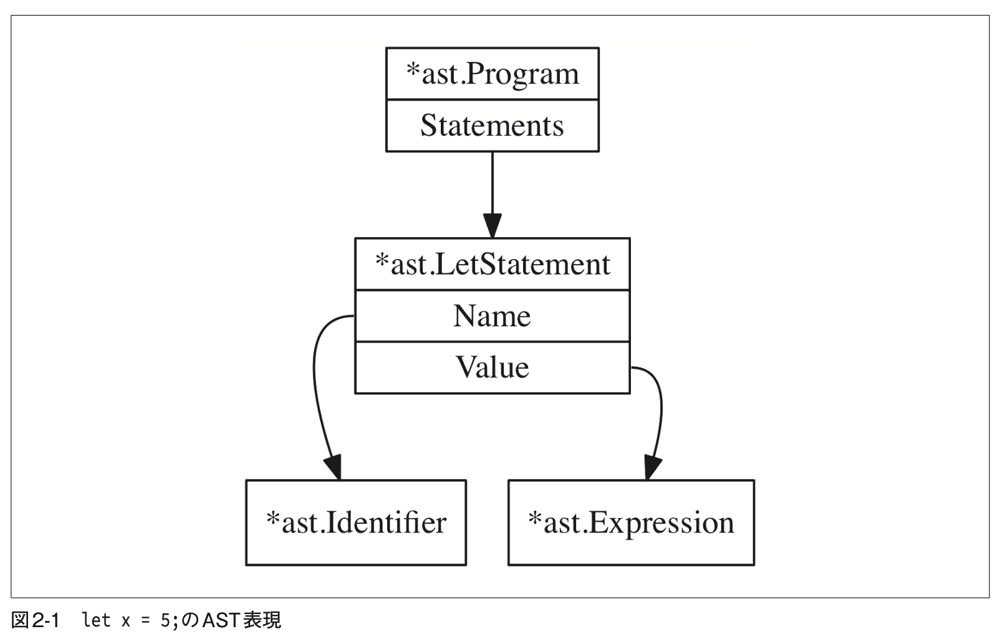

# Go 言語でつくるインタプリタ

主に Go 言語の学習をメインとした写経

## Go

### interface

メソッドの型だけを定義した型の一種であり、任意の型がどのようなメソッドを実装するべきかを規定

### struct

Class という概念がない代わりとしての役割を果たす

## 構文解析器

2 つ戦略がある

- トップダウン構文解析
  - 再帰下降構文解析 // こんかいはこれ Pratt 構文解析器
  - アーリー法
  - 予測的構文解析
- ボトムアップ構文解析

### 文(statement)の構文解析

文が一番基本的な解析
=> 式
=> その他のサブセット

let, return

文と式の違いについて
式は値を生成し、文はしない

let x = 10; は式は 10 で、 10 は値を生成し、`let x = 10` は値を生成しない
という区別を今回は認識する(言語等でそれぞれ違う解釈が存在する)

### LetStatement インターフェイス

構成としては `let x = 5;` で考えると楽

- 定義する変数の名前(x) => Name(Identifier 構造体)
- 定義した変数に挿入される値(5) => Value
